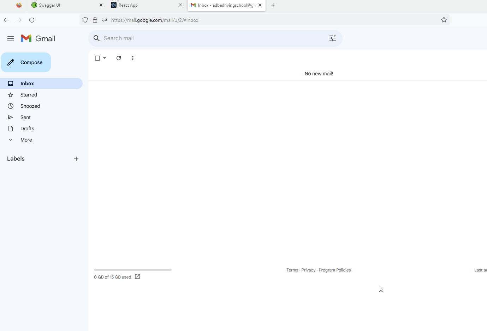

# DrivingSchoolRegistration

Author: Edgars Berzins

## About

This project is a Driving School Registration System designed to handle student enrollment for theory and practical driving lessons. It allows driving school consultants to register students and enter their information into the system. After entering the necessary data, the student will recive a unique code via email.
Project uses .NET Core API to handle the communication between the React frontend and the MySQL database.

  <b> Filter Page </b> 
  

## Installation and Setup Instructions

To run the project locally, follow the instructions below:

- Make sure you have Node.js and npm (Node Package Manager) installed on your machine.

- Clone the GitHub repository.
- Ensure that you have a MySQL database set up. Update the .NET Core API to use your MySQL database by providing the necessary connection details.
- Configure the email sending functionality by updating the .NET Core API with your SMTP server details and credentials.
- Install the React project dependencies.
- Start .NET Core API and React app.

The React app will run on http://localhost:3000, and it will send data to http://localhost:5030, where the .NET Core API is running.

Feel free to explore the project and make any necessary modifications to suit your specific environment and requirements.

## Potential Future Improvements

The following are potential future improvements for the DrivingSchoolRegistration project:

- Implementing additional unit tests in both the .NET Core API and React components to ensure the reliability and robustness of the system. This includes testing various scenarios and edge cases to validate the functionality and identify potential issues.
- Enhancing validation on the API side to ensure that all incoming data is properly validated and meets the required criteria. This can include implementing server-side validation rules and error handling to provide meaningful feedback to the driving school consultant when entering student data.
- Exploring additional features and functionalities that can enhance the user experience and streamline the registration process. This can include features such as autocomplete for address fields, real-time data validation, and error highlighting in the user interface.
- Improving error handling and error reporting mechanisms to provide clear and informative error messages to both the driving school consultant and the students in case of any issues or validation errors during the registration process.

## Additional Comments

The API controller includes two additional methods: DeleteAll and GetByUniqueId. The DeleteAll method allows for the complete deletion of the database, permanently removing all data. Exercise caution when using this method as it cannot be undone. The GetByUniqueId method retrieves specific student information based on their unique code.
